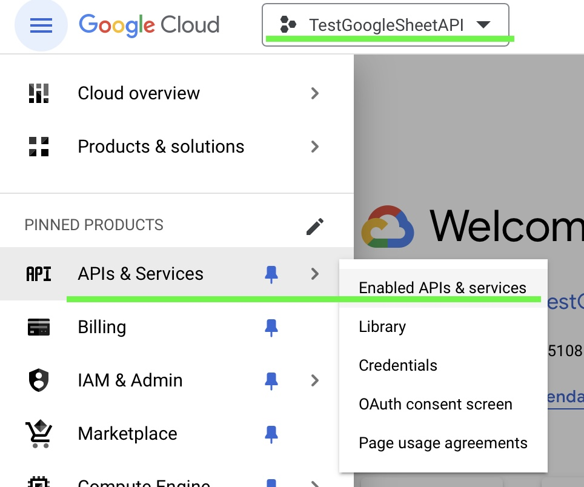
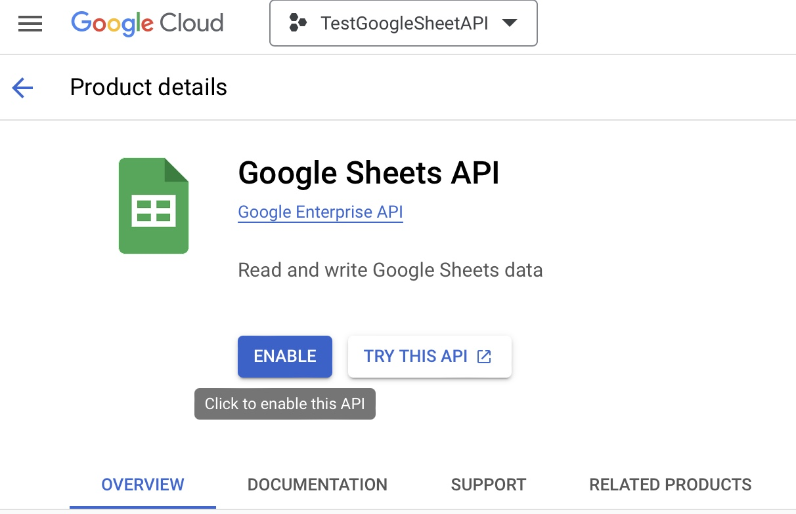
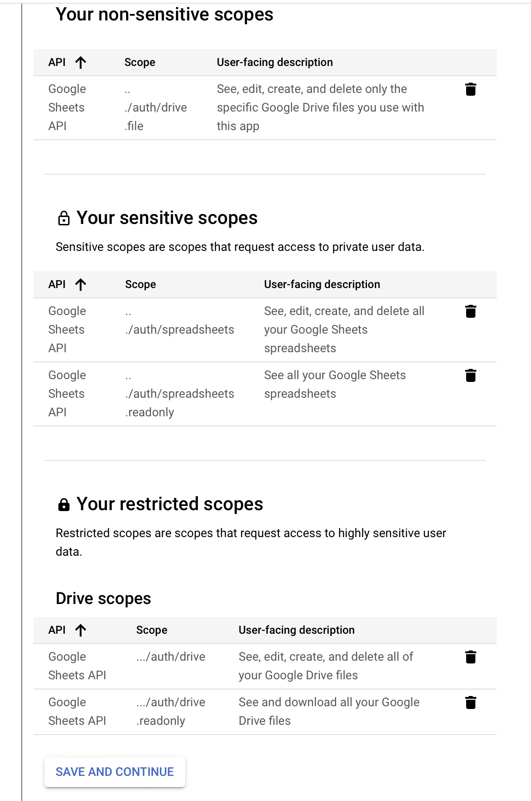
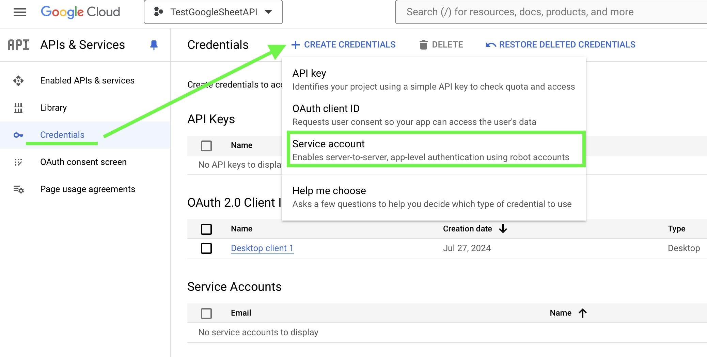
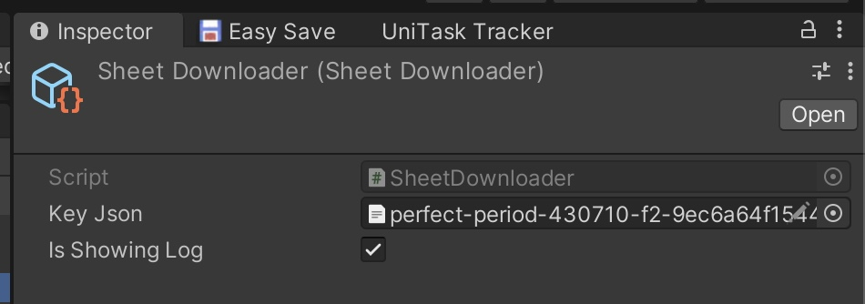
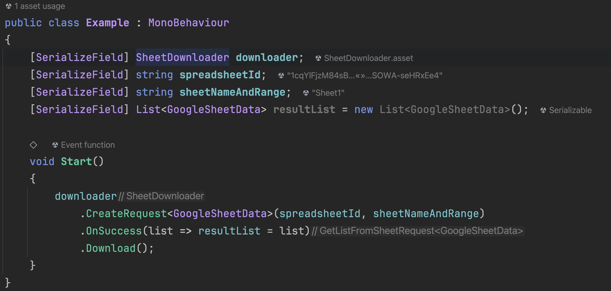
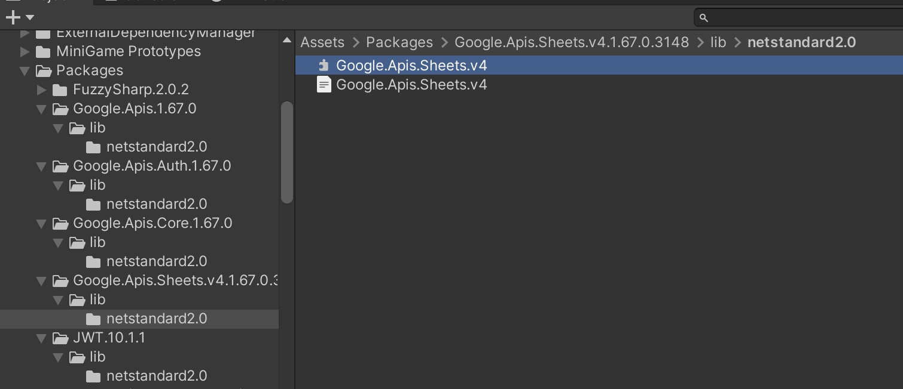

# Google Sheet Downloader

The **SheetDownloader** is a Helper ScriptableObject class that lets you download Google Sheets as serializable data using the Google Sheet API v.4 from NuGet and JsonConvert library. 

# Prerequisite

Google allows external applications to read and edit Google Sheets via the Google Sheets API v4. Before using this API, we need to create a project and set up the API in our Google Cloud Console.

## Setting Up Google Sheets API

1. Log in to the Google Cloud Console via https://console.cloud.google.com/ with your Google account.
2. Create a new project in the Dashboard and switch to that project. Then go to the Navigation Menu (three horizontal lines), and select APIs & Services > Enabled APIs & Services.

4. Click on “Enabled APIs and Services,” search for Google Sheets, and then click “Enable.”

5. Create Credentials to start using the API by selecting the type of data access as User data.
6. Click Next and provide the project details, including the Developer Support Email.
7. Add API Scopes by selecting the necessary scopes you will use.

8. Choose the Application Type as the platform you want to use the Google Sheets API with. If you’re using it in Unity Editor or Windows build, select Desktop Application (select Android or iOS if using in Android/iOS Build).
9. Go to the Credentials tab to create a Service Account with the 'Editor' role. This Service Account will read the target Google Sheets from which we want to download.
10. In the Keys tab, add a new Service Account by creating a new JSON key and download it. Store this key safely as it is required to use the API.

11. Modify the access permissions of the target Google Sheets by adding the Service Account Email address we just created.

Now, you will be able to read/edit data on that sheet from external applications.
The Google Sheets API is free to use but has a quota limit. You can read more details at this link: https://developers.google.com/sheets/api/limits.

## Installing Google Sheet API package in Unity

After setting up the Google Sheets API on the cloud, it’s time to install the Google Sheets API package in our Unity project.

The Google Sheets API does not have an official package available for direct download via the Unity Package Manager. However, you can download and install the NuGet Package Manager for Unity to get the Google Sheets API. 

1. You can download NuGet for Unity here: https://github.com/GlitchEnzo/NuGetForUnity.
2. After installing NuGet for Unity, open the NuGet Package Manager from the top Menu Item: NuGet > Manage NuGet Packages, and install the package named Google.Apis.Sheets.v4 in your project. (This package will automatically install other necessary packages for you)

You’re now ready to use the Google Sheets API to access Google Sheets shared with the Service Account.

## The Secret Sauce

If you don’t want to spend time writing code to authenticate and directly use the Google Sheets API, you can use my sample code in this directory for downloading Google Sheets as JSON data.

### Usage Instructions:

1. Import the sample code into your project and create a Scriptable Object of type SheetDownloader.

2. Assign the JSON key file of the Service Account you created earlier in the keyJson field.
3. Use the CreateRequest<T> function from SheetDownloader to download data from Google Sheets as the desired type, as shown in the **Example.cs**

## Notes
1. Remember that the Google Sheet you want to load must have been shared with the Service Account's email.
2. The **spreadsheetId** for each Google Sheet can be obtained directly from the URL, located between **d/** and **/edit**.
3. When building your game for iOS, Android, or other platforms, ensure that the **.dll** files of the Google Sheets API dependency packages are set to target that platform. Check for them inside the folder **Assets/Packages/…(package name)…./netstandard2.0/.**

4. On iOS, if you encounter errors due to JSON deserialization issues, you can resolve this by setting the **Managed Stripping Level to Minimal in Player Settings > Other Settings > Optimizations.**
More details here: https://discussions.unity.com/t/serialization-works-well-in-editor-but-not-on-mobile/771203
