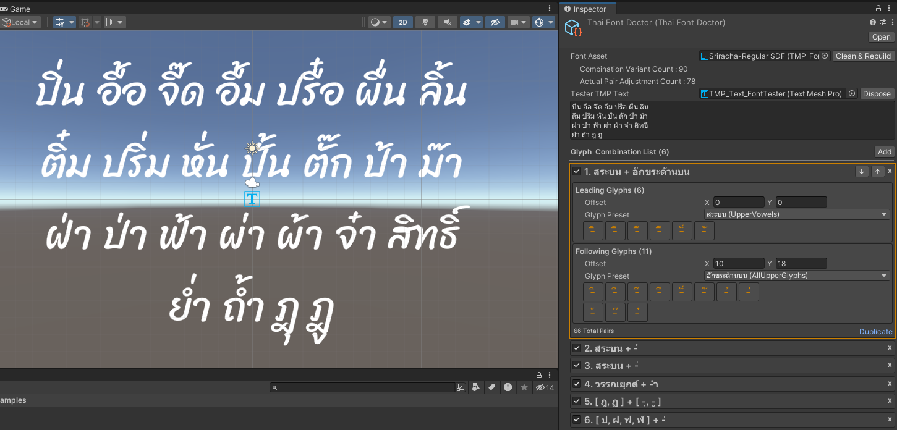

# Important Note!
## 🎉**Thai Font Doctor** is now a part of [**Thai Text Care for Unity**](https://github.com/phanphantz/ThaiTextCare-for-Unity)🎉
This library provides enhanced Thai language support for Unity's TextMeshPro such as Thai Word Segmentation and Thai Font Glyphs fixer for overlapped vowels/tone marks, significantly improving your experience when working with Thai language in Unity.

### Consider using this package instead to receive up-to-date features and supports.

 

  

<i>Thai Word Segmentation</i>

 

<i>Thai Glyph Adjustment Automation</i>

 

# Thai Font Doctor
**Thai Font Doctor** is a lightweight Unity Editor tool designed to fix Thai font issues—like misaligned vowels and tone marks—within minutes! By automating glyph pair adjustments in TextMeshPro's Font Asset, it turns a previously tedious task into a quick, hassle-free experience. 

*Tested with TextMeshPro package version 3.0.9*

## How it Works
**ThaiFontDoctor** is a ScriptableObject that processes TextMeshPro's **TMP_FontAsset**, automating adjustments to glyph pairs based on predefined **Glyph Combinations**.

When you set a **Glyph Combination**, you specify which Thai character glyphs should pair together and the appropriate offset for each pair. ThaiFontDoctor then updates the **GlyphAdjustmentTable** in your **TMP_FontAsset** in real-time, making it easy to fine-tune how vowels and tone marks appear in your TMP_Text components. 

## Key Features
Take a look at **ThaiFontDoctor.asset** for an example. This instance of ThaiFontDoctor's ScriptableObject already has some common GlyphCombinations for solving Thai font issues on it:

- Use the **Add** button to create new Glyph Combinations or click on existing ones to edit them.
- On each GlyphCombination, you can specify the characters and adjustment offset of the **Leading Glyphs** and **Following Glyphs**. 
- Use the **Create In Scene** button behind the **Tester TMP Text** field to quickly create a TMP Text component to see how the font is displayed in real-time.
- Every action performed on the **ThaiFontDoctor** inspector is fully Undo-supported, so you can safely experiment with your adjustments.
- When modifying Glyph Combination, You can use **GlyphPreset** to easily insert common Thai character sets, or choose the **กำหนดเอง (Custom)** preset to fine-tune specific glyphs as needed.
  
Here are the available **GlyphPresets** and its glyph members :
| ThaiGlyphPreset | Display Name | Glyph Members | 
|-----------------------|--------------------------|---------------------------------------------------------------------------------------------------| 
| AllConsonants | ก - ฮ | ก, ข, ฃ, ค, ฅ, ฆ, ง, จ, ฉ, ช, ซ, ฌ, ญ, ฎ, ฏ, ฐ, ฑ, ฒ, ณ, ด, ต, ถ, ท, ธ, น, บ, ป, ผ, ฝ, พ, ฟ, ภ, ม, ย, ร, ล, ว, ศ, ษ, ส, ห, ฬ, อ, ฮ | 
| AscenderConsonants | พยัญชนะหางบน | ป, ฝ, ฟ, ฬ | 
| DescenderConsonants | พยัญชนะหางล่าง | ฎ, ฏ | 
| AllUpperGlyphs | อักขระด้านบน |- ิ, - ี, - ึ, - ื, - ็, - ั, - ์, - ่, - ้, - ๊, - ๋ | 
| UpperVowels | สระบน |- ิ, - ี, - ึ, - ื, - ็, - ั | 
| ToneMarks | วรรณยุกต์ |- ่, - ้, - ๊, - ๋ | 
| ThanThaKhaat | ทัณฑฆาต |- ์ | 
| LeadingVowels | สระหน้า | เ-, แ-, โ-, ไ-, ใ- | 
| AllFollowingVowels | สระหลัง | -ะ, - ำ, -า, -ๅ | 
| SaraAum | สระอำ |- ำ | 
| LowerVowels | สระล่าง |- ุ, - ู | 

## Limitations
- If multiple Glyph Combinations target the same glyphs, only the last adjustment will be applied. You can reorder combinations by selecting one of them and use the Up Arrow or Down Arrow buttons to prioritize adjustments.
- ThaiFontDoctor doesn't modify the displayed text based on Unicode replacements. Issues like YoYing ( ญ ) and ThoThan ( ฐ ) incorrectly rendering with lower vowels like Sara Uu ( ู ) remains. Use [**Thai Text Care for Unity**](https://github.com/phanphantz/ThaiTextCare-for-Unity)'s **ThaiTextNurse** component to fix this issue.
- Multi-edit feature is not supported.

   
  
